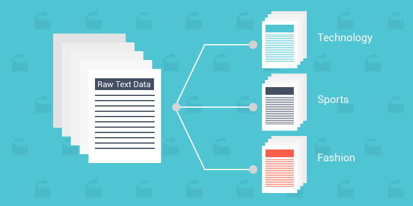

# Text-Classification-SVD-LSA-
Text Classification on the PERSICA dataset with SVD (LSA) and different classical classification methods such as SVM and Naïve Bayes

This repository focuses on Text Classification using the PERSICA dataset. The analysis incorporates Singular Value Decomposition (LSA) and various classical classification methods such as Support Vector Machine (SVM) and Naïve Bayes. The repository contains code, reports, and resources related to this text classification project.

## Repository Structure

- **HW4 - Iman Kianian - NLP.ipynb**: Jupyter notebook containing the Text Classification code.
- **HW4.pdf**: PDF document providing detailed questions of this assignment.
- **Persian_StopWords.txt**: List of Persian stopwords used during the analysis.
- **README.md**: Initial commit information and repository overview.
- **Report.pdf**: Comprehensive report summarizing the Text Classification analysis.
- **SVMConfusion.png**: Confusion matrix visualization for Support Vector Machine (SVM) algorithm.
- **SVM_NaiveBayes_Comparison.png**: Visual comparison between Support Vector Machine (SVM) and Naïve Bayes algorithms.
- **TextClassification.png**: Image related to text classification results.
- **Topic_Modeling_Persian_StopWords.txt**: Additional stopwords specific to topic modeling in Persian.
- **persica.csv**: Dataset used for Text Classification.
- **stop.txt**: General stopwords used during the analysis.
- **stopwords2.txt**: Another set of stopwords used for data preprocessing.

## Usage

- Refer to the Jupyter notebook, "HW4 - Iman Kianian - NLP.ipynb," for the Text Classification code.
- Access the PDF documents for in-depth information on the analysis and results.
- Visualize algorithm comparisons through the provided PNG images.
- Utilize the provided datasets and stopwords for your own Text Classification tasks.

## Contributions

Contributions to this repository are welcome. Feel free to submit pull requests for improvements, bug fixes, or new features.

## License

This project is under the [MIT License](LICENSE), allowing you to use, modify, and distribute the code for personal or commercial purposes.

If you have any questions or need further clarification, please reach out. Happy classifying!

